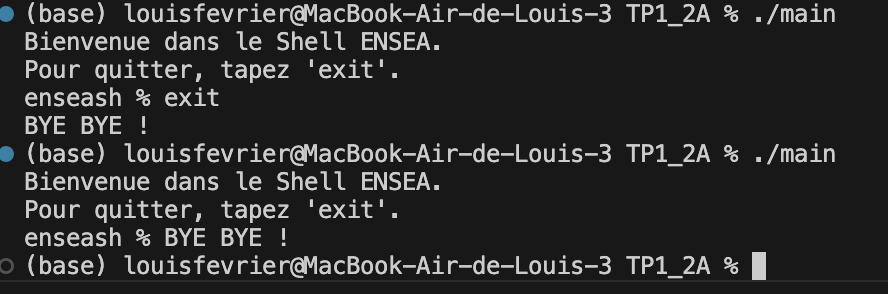
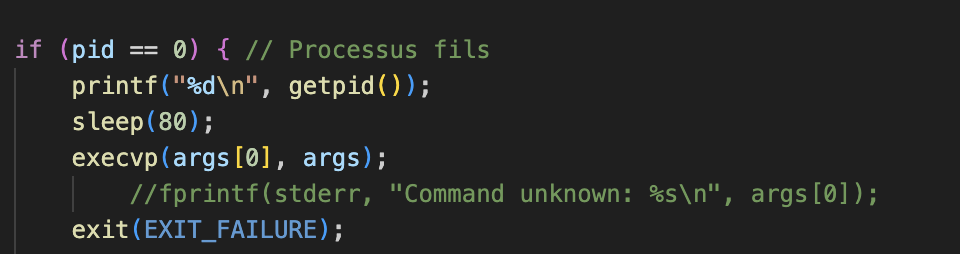
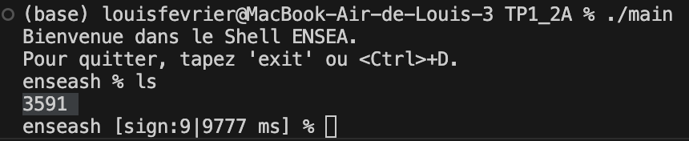
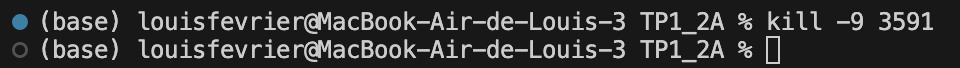
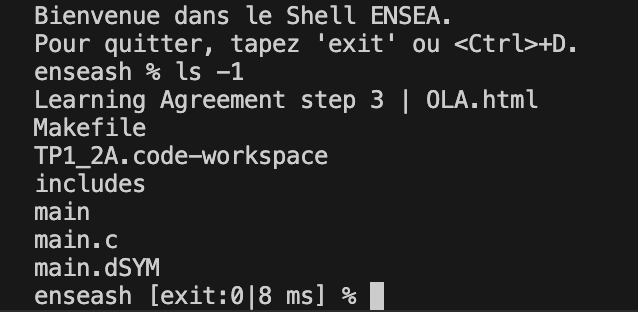
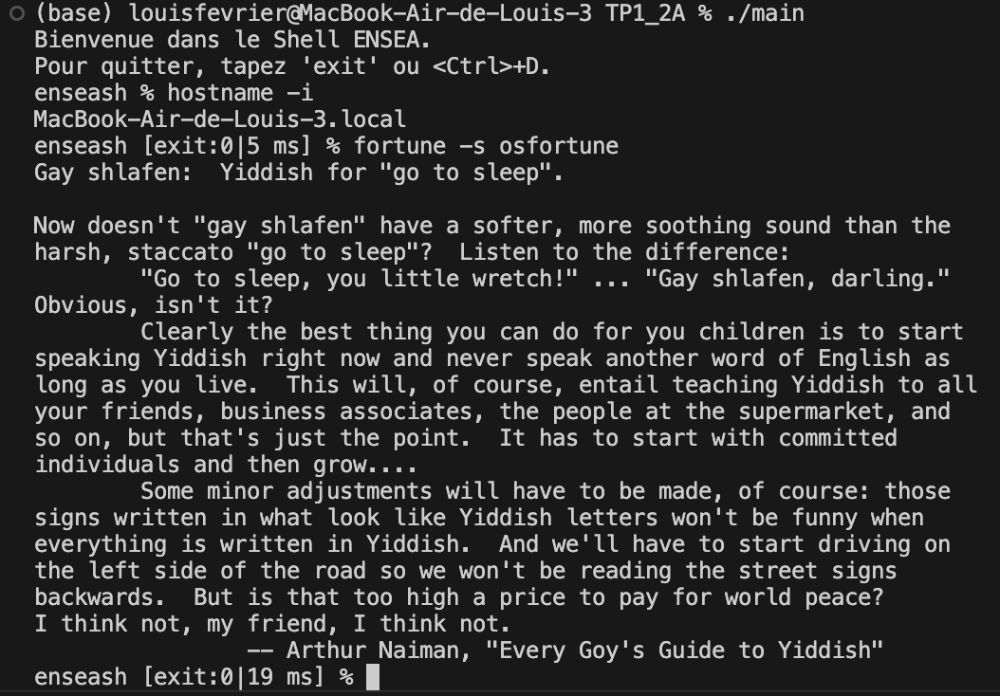
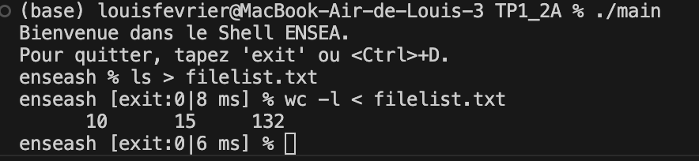

Bonjour, Voici le déroulé de mon TP1 : 
Question 1 et 2 : Nous affichons le prompt, le message d'accueil, et notre console comprend des fonctions simples :  
Question 3 : Notre console détecte le mot exit ou un controle D et la console se ferme : 
Question 4 et 5 : Nous modifions le retour de la console de sorte à connaitre le type de sortie et le temps utiliser, pour tester avec SIGN nous utilisons une autre console pour tuer notre processus fils : 
    J'ai donc modifié le code du processus fils pour qu'il puisse afficher son PID et ensuite être en attente :  
    J'ai donc ensuite utilisé 2 consoles pour pouvoir tuer le processus fils lorsque celui-ci était en attente : 
    Console numéro 1, le processus fils affiche son PID puis s'endort et est ensuite tué par la console numéro 2 :  
    Console numéro 2, elle tue notre processus fils  :  

Question 6 : Nous créons une fonction qui découpe l'entrée console (input) pour ensuite analyser les commandes complexes :  
Question 7 : Nous devons créer des fonctions qui permettent de rediriger l'entrée ou la sortie des fichiers, ici l'ordre entre les actions étaient compliqués puisque j'ai d'abord recherché les espaces puis les <>, or il faut procéder de dans le sens inverse. Il faut d'abord cherhcer <> puis ensuite les espaces, sinon nous obtenons des erreurs dans la lecture et l'analyse : 
